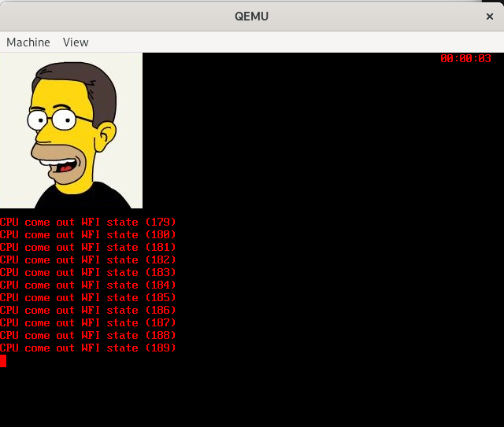

# Lecture Homework Week 07 - Thursday

For this lecture homework, you will explore events using the Timer driver.

## Getting the Code

As with the previous lecture homework, this assignment is hosted on GitHub. Create your own repository using the assignment repository as a template. To do this:

1. Click on **"Use this template."**
2. Select **"Create a new repository."**
3. Give your repository a descriptive name.
4. Click **"Create repository."**

Once created, clone the repository or open it in a GitHub Codespace to begin working.

## Adding Your Logo

If you attempt to compile the program immediately after cloning, it will fail with the following error:

```bash
mkdir build
cmake -S . -B build
cmake --build build
...
arm-none-eabi-objcopy: '../image0.bmp': No such file
...
```

This occurs because no image is included in the repository to act as your OS logo. You must provide your own logo (`image0.bmp`). Convert your chosen image to BMP format if it isn't already.

**Requirements:**

* The image must be an appropriate size to fit on the display.
* The image must be a **new** image (not the same `image0.bmp` used in the previous lab).

## Running the Code

Compile the project as you have done previously and run it using QEMU:

```bash
qemu-system-arm -M versatilepb -m 128M -kernel build/timer-event.bin -serial mon:stdio
```

## The Timer Event Demo

The code for this demo produces timer interrupts at a regular rate. After enough events (60 in the given code), the timer in the upper right corner increments by one second. After 5 seconds, a message is printed on the display. At the end of the loop, the code goes to sleep until an interrupt wakes it up. This low-power sleep is the goal of a good embedded system, as it lowers power consumption.

Previously, the super-loop would just spin tightly, actually executing code with each iteration until interrupted. However, this code goes into a low-power sleep until outside hardware generates an interrupt.

We can see this behavior in the code below:

```c
  for (uint32_t itr = 0; 1; itr++) {
    if (one_second) {
      wall_clock(&timer[0]);
      one_second = 0;
    }
    if (five_seconds) {
      printf("five seconds event\n");
      five_seconds = 0;
    }

    asm("MOV r0, #0; MCR p15, 0, R0, c7, c0, 4");  // enter WFI mode
    printf("CPU come out WFI state (%d)\n", itr);
  }
```

Going into more detail, the code above loops and checks a flag, `one_second`. If this flag is `1`, then it calls the `wall_clock` function. This function updates the timer object and prints the elapsed time in the upper right-hand corner. Notice this is not done in the interrupt handler, but rather in the super-loop. The bulk of the work is done here instead of the interrupt handler, which should finish as quickly as possible. There's a similar flag that is set to `1` in the interrupt every 5 seconds.

Finally, the inline assembly code causes the ARM processor to sleep after telling an external coprocessor to wake it up when the next interrupt occurs. If you wish to understand exactly what the code is doing, ask your favorite AI.

Now, compile and run the program. You should see a very slow "second". You should see something like the following:



Each timer interrupt actually lasts 1 or 2 seconds. According to the code, we should get 60 interrupts per second. Let's fix this issue.

## Making the Elapsed Time Actually 1 Second

The amount of time for each timer interrupt is set in the `timer_init` function. The code for this configuration is below:

```c
    *(tp->base + TLOAD) = 0x0;          // reset
    *(tp->base + TVALUE) = 0xFFFFFFFF;  // read only; can be any value
    *(tp->base + TRIS) = 0x0;           // status
    *(tp->base + TMIS) = 0x0;           // status
    *(tp->base + TLOAD) = 0x100;
    // CntlReg=011-0110=|En|Pe|IntE|-|scal=01|32bit|0=wrap|=0x66
    *(tp->base + TCNTL) = 0x66;
    *(tp->base + TBGLOAD) = 0x1C00;     // timer counter value
```

The pertinent value here is `0x1C00`. This number is the cycle ticks between each interrupt. The other pertinent value is in the timer handler.

```c
void timer_handler(int n) {
  TIMER* t = &timer[n];
  t->tick++;
  if (t->tick == 60) {
    t->tick = 0;
    t->ss++;
```

This code causes the second counter, `ss`, to be incremented every 60 interrupts. We'll start fixing the slowness of our demo by changing this value. I'll give you this value: it's `12`. Change the value `60` in the code above to `12` and see what happens.

Recompile and run the program again. With these new values, it should be closer to one second for each update of the time in the upper right corner. If you wait for longer than 5 seconds, you can even see the message `five seconds event`. But there's still a lot of noise from the messages that start with `CPU come out WFI state`.

Let's fix this issue by making the message print once per second. The first step is to change the `12` above to `1`. If we do just that, the time will elapse too fast. So, your job is to change `0x1C00` to a larger value to increase the time between each interrupt to as close to 1 second as you can. I'll let you figure out what that value is.

Find that value, then recompile and run the program before moving on to the problem from the book below.

## Problem from the Book

The following problem is given on page 114 of the book. Do what it asks, and write your answers in the homework template from this repo.

### Problem Statement

In Example Program C4.3, after initializing the system, the `main()` function executes a `while(1)` loop:

```c
int main() {
// initialization
  while(1){
    asm("MOV r0, #0; MCR p15,0,R0,c7,c0,4");
    printf("CPU out of WFI state\n");
   }
}
```

1. Comment out the `asm` line. Run the program again to see what would happen.
2. In terms of CPU power consumption, what difference does the `asm` statement make?

## What to Turn In

**Homework Template:**

1. Open `homework_template.docx`, and answer the questions regarding the problem from the book.
2. Export the document as a PDF.
3. Add the PDF to your repository.

**Modified Files:**

* `src/timer.c`
* `assets/` (containing your QEMU and Serial Monitor screenshots)
* `image0.bmp` (with your logo so it will compile on Gradescope)

**Submission Steps:**

1. Commit and push all changes to GitHub.
2. Submit the assignment via **Gradescope**.
3. Select your repository when prompted.
